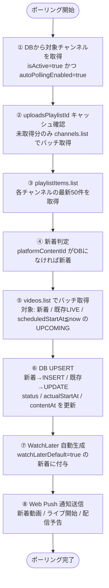
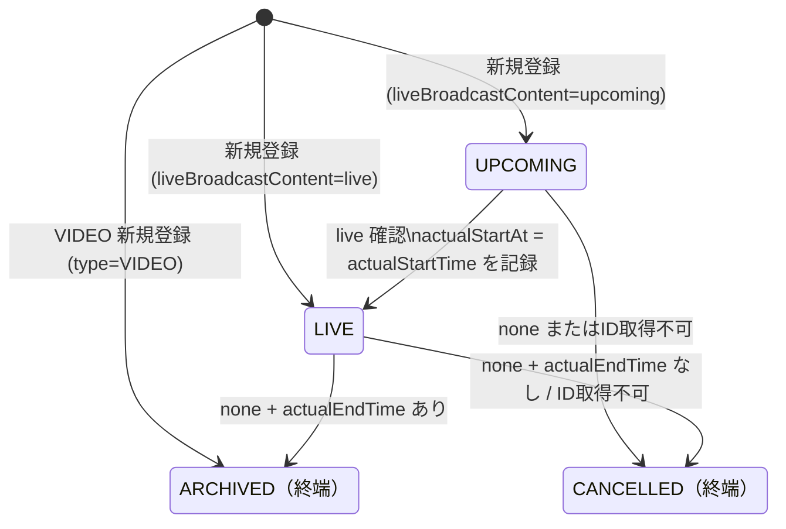

# 技術設計書 - MySubChs

> **スコープ**: アプリケーションの技術スタック、システム構成、認証フロー、ポーリング設計、ページネーション設計など、アプリケーションレベルの技術設計を扱う。DB スキーマは [database.md](./database.md)、インフラ（Docker Compose・環境変数・AWS 移行）は [infrastructure.md](./infrastructure.md)、Service Worker / PWA は [ui/pwa.md](./ui/pwa.md) を参照。

## 1. 技術スタック

### フロントエンド
| 項目 | 採用技術 | 理由 |
|---|---|---|
| フレームワーク | Next.js 14 (App Router) | フロント・APIを1プロジェクトで管理、VibeCodingとの親和性が高い |
| 言語 | TypeScript | 型安全性、AIコード生成の精度向上 |
| スタイリング | Tailwind CSS | レスポンシブ対応が容易、クラスベースで可読性が高い |
| UIコンポーネント | shadcn/ui | 高品質なコンポーネント群、カスタマイズ性が高い |
| 状態管理 | React Query (TanStack Query) | サーバー状態管理、キャッシュ・再取得が容易 |

### バックエンド
| 項目 | 採用技術 | 理由 |
|---|---|---|
| APIサーバー | Next.js API Routes | フロントと同一プロジェクト、初期構成のシンプルさ |
| 認証 | NextAuth.js (Auth.js) | Google OAuth対応、セッション管理が簡単 |
| ORM | Prisma | TypeScript型安全、マイグレーション管理が容易 |
| バックグラウンドジョブ | BullMQ | ポーリングジョブのキュー管理、リトライ制御 |

### データストア
| 項目 | 採用技術 | 理由 |
|---|---|---|
| RDB | PostgreSQL 16 | リレーショナルデータに最適、AWS RDS互換 |
| キャッシュ/キュー | Redis 7 | BullMQのバックエンド、AWS ElastiCache互換 |

### インフラ
| 項目 | 採用技術 | 理由 |
|---|---|---|
| コンテナ | Docker + Docker Compose | ローカル環境の統一、AWS移行時の可搬性 |
| PWA | next-pwa | Web Push通知、ホーム画面追加対応 |

### バックエンド設計方針

#### 外部依存値の管理
外部サービスの仕様に由来する数値（API クォータ上限、レート制限、しきい値など）はコード中にハードコードしない。専用の設定ファイル（`src/lib/config.ts` 等）に名前付き定数として定義し、一箇所で管理する。

- 例: YouTube API の1日あたりクォータ上限 `10,000` → `YOUTUBE_QUOTA_DAILY_LIMIT`
- 例: クォータ警告しきい値 `9,000` → `YOUTUBE_QUOTA_WARNING_THRESHOLD`

フロントエンドが外部依存値を必要とする場合は、バックエンドの API レスポンスを通じて渡す（フロントエンドに直接ハードコードしない）。

---

## 2. システム構成図

```
[ブラウザ / スマホ]
       │
       ▼
┌─────────────────────────┐
│    Next.js App          │
│  ┌─────────────────┐    │
│  │  Pages / UI     │    │
│  └────────┬────────┘    │
│           │             │
│  ┌────────▼────────┐    │
│  │  API Routes     │    │
│  │  - /auth/*      │    │
│  │  - /api/...     │    │
│  └────────┬────────┘    │
└───────────┼─────────────┘
            │
     ┌──────┴──────┐
     ▼             ▼
┌─────────┐  ┌──────────┐
│PostgreSQL│  │  Redis   │
│  (DB)   │  │ (Queue)  │
└─────────┘  └────┬─────┘
                  │
             ┌────▼──────┐
             │  BullMQ   │
             │  Worker   │
             │(Polling)  │
             └────┬──────┘
                  │
             ┌────▼──────┐
             │ YouTube   │
             │ Data API  │
             └───────────┘
```

---

## 3. ディレクトリ構成

```
MySubChs/
├── docs/                      # 仕様ドキュメント
│   ├── requirements.md
│   ├── architecture.md
│   ├── database.md
│   ├── infrastructure.md
│   ├── openapi.yaml
│   └── ui/
│       ├── dashboard.md
│       ├── channels.md
│       ├── categories.md
│       ├── settings.md
│       ├── login.md
│       └── pwa.md
├── src/
│   ├── app/                   # Next.js App Router
│   │   ├── (auth)/
│   │   │   └── login/
│   │   ├── (dashboard)/
│   │   │   ├── page.tsx       # メイン画面
│   │   │   ├── channels/
│   │   │   ├── categories/
│   │   │   └── settings/
│   │   └── api/
│   │       ├── auth/          # NextAuth
│   │       ├── channels/
│   │       ├── categories/
│   │       │   └── [id]/
│   │       │       └── poll/  # POST: カテゴリ手動ポーリング
│   │       ├── contents/
│   │       ├── watch-later/
│   │       └── notifications/
│   ├── components/
│   │   ├── ui/                # shadcn/ui コンポーネント
│   │   ├── layout/
│   │   └── features/          # 機能別コンポーネント
│   ├── lib/
│   │   ├── auth.ts            # NextAuth設定
│   │   ├── db.ts              # Prismaクライアント
│   │   ├── redis.ts           # Redisクライアント
│   │   └── platforms/         # プラットフォームアダプター
│   │       ├── base.ts        # 抽象インターフェース
│   │       └── youtube.ts     # YouTube実装
│   ├── jobs/
│   │   ├── polling.ts             # BullMQポーリングジョブ（Watch Later自動付与ロジック含む）
│   │   ├── watchLaterCleanup.ts   # 期限切れWatchLaterレコードの定期削除
│   │   └── contentCleanup.ts      # 保持期間超過Contentの物理削除
│   └── types/
├── prisma/
│   └── schema.prisma
├── public/
├── worker/
│   └── index.js               # Service Worker カスタムロジック (next-pwa がバンドルして public/ に出力)
├── docker-compose.yml
├── Dockerfile
└── .env.example
```

---

## 4. プラットフォームアダプターパターン

将来の他プラットフォーム対応に備え、チャンネル・コンテンツ取得ロジックをインターフェースで抽象化する。

```typescript
// src/lib/platforms/base.ts
interface PlatformAdapter {
  getSubscribedChannels(accessToken: string): Promise<Channel[]>
  getRecentContents(channelId: string): Promise<Content[]>
  getLiveStatus(channelId: string): Promise<LiveStatus>
}

// プラットフォーム識別子
type Platform = 'youtube' | 'twitch' // 将来追加
```

---

## 5. 認証フロー

```
1. ユーザーが「Googleでログイン」ボタンをクリック
2. NextAuth → Google OAuth 2.0 認証
3. コールバック：アクセストークン・リフレッシュトークンをDBに保存
4. セッション確立（JWT）
5. 以降のAPI呼び出しはセッションで認証
6. アクセストークン期限切れ時はリフレッシュトークンで自動更新
```

### 初回ログイン時の即時ポーリング

初回ログイン時（`UserSetting` が存在しない場合が「初回」の判断基準。`UserSetting` の初回自動生成については [database.md §4](./database.md) を参照）に、NextAuthのsignInコールバックからBullMQジョブを即時エンキューする。

```
初回ログイン判定フロー:
1. NextAuth signIn コールバックが呼ばれる
2. UserSetting.upsert でデフォルト値を登録（createdAt が今に近いかどうかで初回判定は不可。
   代わりに「UserSetting が存在しない = 初回」として、upsert 前に存在確認を行う）
3. 初回の場合のみ BullMQ に「初回セットアップジョブ」を即時追加（delay: 0）
4. 通常のRepeatable Jobとは別の1回限りのジョブとして実行
```

初回セットアップジョブの処理内容:
1. **チャンネル同期**（後述「チャンネル同期フロー」と同一ロジック）を実行し、YouTubeの登録チャンネルをDBに登録する
2. 続けて**通常のポーリング処理**（§6「ジョブの流れ」Step 1〜8）を実行する

> **注**: 2回目以降のログインでは即時ジョブをエンキューしない。DBにはすでにチャンネルが存在するため、通常の Repeatable Job によるポーリングで最新状態に追従する。

### チャンネル同期フロー

初回セットアップジョブおよび手動再同期（`POST /settings/sync-channels`）で共通して使用する処理。

```
1. subscriptions.list（YouTube Data API v3）で現在の登録チャンネルを全件取得（50件/ページ・全ページ取得）
2. channels.list でチャンネルのメタデータ（名前・アイコンURL・uploadsPlaylistId）をバッチ取得（最大50件/call）
3. DBに存在しないチャンネル → 新規登録（isActive=true）
4. DBに存在し isActive=false のチャンネル → YouTubeでまだ登録中なら isActive=true に復元
5. DBに存在し isActive=true のチャンネル → YouTubeで登録解除済みなら isActive=false に更新
6. チャンネル名・アイコンURL・uploadsPlaylistId などのメタデータを最新の状態に更新
```

スコープ：
- `https://www.googleapis.com/auth/youtube.readonly`（登録チャンネルの読み取りのみ）

### BullMQ Worker でのOAuthトークン更新

BullMQ Worker は NextAuth のセッション層と独立して動作するため、トークン更新を独自に実装する必要がある。

```
Worker の YouTube API 呼び出しフロー:
1. DBの Account テーブルから access_token / refresh_token / expires_at を取得
2. expires_at < now() の場合 → Google Token Endpoint に refresh_token でリクエスト
   POST https://oauth2.googleapis.com/token
   { grant_type: "refresh_token", refresh_token: "...", client_id: "...", client_secret: "..." }
3. 成功 → Account.access_token と Account.expires_at を更新してジョブを継続
4. 失敗（revoked / invalid_grant 等）→ ジョブを即時 FAILED 終了・エラーログ記録
   （リトライ不要。無限リトライを防ぐため BullMQ の attempts は 1 に設定）
```

---

## 6. ポーリング設計

- BullMQ の Repeatable Job で定期実行。**カテゴリごとに独立した Repeatable Job** `auto-poll:{categoryId}` を使用する
- デフォルト間隔：**30分**（クォータ制約による。詳細は後述のクォータ計算を参照）
- **ポーリング間隔の変更はジョブ設定の更新によって次のジョブサイクル開始時から反映される（実行中のジョブには影響しない）**
- グローバルポーリング間隔は `UserSetting.pollingIntervalMinutes` で管理する。カテゴリ個別の間隔は `NotificationSetting.pollingIntervalMinutes` で上書きできる（[database.md §4](./database.md) 参照）

### 有効間隔の計算

各カテゴリの有効ポーリング間隔（effectiveInterval）は以下の式で計算する:

```
effectiveInterval = NotificationSetting.pollingIntervalMinutes
                    ?? UserSetting.pollingIntervalMinutes
```

### カテゴリ別ジョブのライフサイクル

| イベント | 処理 |
|---|---|
| カテゴリ作成 | `autoPollingEnabled=true` の場合のみジョブ登録。間隔 = グローバルデフォルト（`NotificationSetting.pollingIntervalMinutes` は NULL で作成） |
| カテゴリ削除 | `auto-poll:{categoryId}` を `removeRepeatable()` で削除 |
| `pollingIntervalMinutes` 変更 | `autoPollingEnabled=true` の場合: 旧ジョブ削除 → 新間隔でジョブ再登録。`autoPollingEnabled=false` の場合: DB のみ更新・BullMQ 操作なし（次回 `autoPollingEnabled=true` になったときに最新の `pollingIntervalMinutes` でジョブが登録される） |
| `autoPollingEnabled` → false | `removeRepeatable()` でジョブ削除。`pollingIntervalMinutes` は変更しない（再度 ON にしたとき以前の間隔を復元するため） |
| `autoPollingEnabled` → true | 有効間隔でジョブ登録 |
| グローバル設定変更（`PATCH /api/settings`） | `NotificationSetting.pollingIntervalMinutes IS NULL` の全カテゴリのジョブを一括更新 |

> **注**: PostgreSQL トランザクションと Redis 操作は同一トランザクションにできない。DB 保存成功 → Redis 操作失敗 の場合、DB と Redis で間隔が不整合になる可能性があるが、Worker 起動時の自己修復処理（後述）で解消される。

**ジョブ更新手順（間隔変更時）:**

```
1. queue.removeRepeatable("auto-poll:{categoryId}", { every: <旧間隔ms> })
   ↓
2. queue.add("auto-poll:{categoryId}", { categoryId }, { repeat: { every: <新間隔ms> } })
```

**実行中ジョブへの影響:**

- 変更時点で実行中のジョブは最後まで完了させる（強制中断しない）
- 新しい間隔は次のジョブサイクル開始時から適用される
- `removeRepeatable()` は次回スケジュールのエントリのみ削除し、実行中のジョブには影響しない

### ジョブ実行スコープ

各 `auto-poll:{categoryId}` ジョブには `categoryId` を payload として渡す。ジョブ実行時は指定カテゴリのチャンネルのみをポーリング対象とする（全カテゴリ横断ではなくカテゴリ単位）。

### Worker 起動時の自己修復

BullMQ の Repeatable Job は **ジョブ名 + `every` の値** を組み合わせた Redis キーで一意性が管理される。そのため、異なる `every` 値でジョブを追加しても旧エントリは自動削除されない。Worker 起動時は必ず以下の手順で整合性を確認・修復する:

```
1. DB の全カテゴリの (categoryId, effectiveInterval, autoPollingEnabled) を取得
   ↓
2. queue.getRepeatableJobs() で既存の Repeatable Job 一覧を取得
   ↓
3. 不整合を検出して修復:
   - 余分なジョブ（DB に存在しないカテゴリ、または autoPollingEnabled=false なのにジョブが存在する）→ removeRepeatable() で削除
   - 欠損ジョブ（autoPollingEnabled=true なのにジョブが存在しない）→ 登録
   - 間隔ズレ（ジョブの every が effectiveInterval と一致しない）→ 旧ジョブ削除 → 新間隔で再登録
   ↓
4. 修復完了後に通常のジョブ処理を開始する
```

この手順により、API ハンドラでの Redis 操作が失敗した場合も Worker 再起動時に自己修復される。

### ポーリング対象チャンネルの判定

チャンネルが定期ポーリングの対象となる条件:
- `Channel.isActive = true`（登録解除済みチャンネルはスキップ）
- `Channel.categoryId IS NOT NULL`（未分類チャンネルは対象外）
- 所属カテゴリの `NotificationSetting.autoPollingEnabled = true`

### ジョブの流れ



1. DBから以下の条件でポーリング対象チャンネルを取得:
   - `isActive = true`（登録解除済みチャンネルはスキップ）
   - 所属カテゴリの `NotificationSetting.autoPollingEnabled` が `true`（未分類チャンネルは対象外）
2. **`uploadsPlaylistId` のキャッシュ取得**：`Channel.uploadsPlaylistId` が `NULL` のチャンネルを最大50件ずつ `channels.list` (1 unit/call) でバッチ取得し、`contentDetails.relatedPlaylists.uploads` をDBに保存。2回目以降はDBの値を再利用（`channels.list` は呼ばない）
3. `playlistItems.list` (1 unit/call) で各チャンネルの **最新50件**を取得（`maxResults=50`）
4. **新着の判断**：取得した `platformContentId` がDBに存在しないもの = 新着コンテンツ
5. **`videos.list` による詳細取得**：以下のビデオIDをまとめて `videos.list` (1 unit/最大50件、`snippet,liveStreamingDetails` パート) でバッチ取得する：
   - 新着コンテンツのビデオID（`type` の判定・`scheduledStartAt` の取得のため）
   - DB上で `status=LIVE` の既存コンテンツのビデオID（`LIVE → ARCHIVED` / `LIVE → CANCELLED` 遷移の検出のため）
   - DB上で `status=UPCOMING` かつ **`scheduledStartAt <= now()`** の既存コンテンツのビデオID（`UPCOMING → LIVE` / `UPCOMING → CANCELLED` 遷移の検出のため）
   - IDが50件を超える場合は複数コールに分けてバッチ処理する
   - `status=UPCOMING` かつ `scheduledStartAt > now()` のコンテンツは対象外（配信予定時刻未到達のため不要）

   `scheduledStartAt <= now()` の UPCOMING コンテンツに対する `videos.list` 結果の扱い：
   - `liveBroadcastContent = live` → `status = LIVE` に更新（Step6のUPSERTで反映）
   - `liveBroadcastContent = upcoming` → `status = UPCOMING` のまま維持（配信延期。`scheduledStartAt` が変更されていれば更新）
   - `liveBroadcastContent = none` → `status = CANCELLED` に更新（Step6のUPSERTで反映）
   - レスポンスにビデオIDが含まれない（削除済み等）→ `status = CANCELLED` に更新（Step6のUPSERTで反映）

   **⑤ videos.list 結果の分岐処理（詳細）:**

   ```mermaid
   flowchart TD
       IN(["⑤ videos.list レスポンス"]) --> KIND{"コンテンツの対象種別"}

       KIND -- "新着" --> N_BC{"liveBroadcastContent"}
       N_BC -- upcoming --> N_UP["INSERT\ntype=LIVE / status=UPCOMING\nscheduledStartAt = scheduledStartTime\ncontentAt = scheduledStartAt"]
       N_BC -- live --> N_LV["INSERT\ntype=LIVE / status=LIVE\nactualStartAt = actualStartTime\ncontentAt = actualStartAt"]
       N_BC -- "none / 応答なし" --> N_VD["INSERT\ntype=VIDEO / status=ARCHIVED\ncontentAt = publishedAt"]

       KIND -- "既存 status=LIVE" --> L_BC{"liveBroadcastContent\nor ID の有無"}
       L_BC -- "none + actualEndTime あり" --> L_AR["UPDATE\nstatus=ARCHIVED\nactualEndAt = actualEndTime"]
       L_BC -- "none + actualEndTime なし\nまたは ID なし" --> L_CA["UPDATE\nstatus=CANCELLED"]

       KIND -- "既存 status=UPCOMING\n(scheduledStartAt ≤ now)" --> U_BC{"liveBroadcastContent\nor ID の有無"}
       U_BC -- live --> U_LV["UPDATE\nstatus=LIVE\nactualStartAt = actualStartTime\ncontentAt = actualStartAt"]
       U_BC -- upcoming --> U_UP["UPDATE（延期）\nscheduledStartAt 更新\ncontentAt = scheduledStartAt"]
       U_BC -- "none または ID なし" --> U_CA["UPDATE\nstatus=CANCELLED"]
   ```

6. **DBへのUPSERT**：取得したコンテンツをDBに登録・更新（新着は `INSERT`、既存は `title`・`status`・各タイムスタンプを `UPDATE`。配信予定のタイトル変更にも対応）
   `url`（コンテンツURL）の設定ルール：
   - INSERT 時にのみ設定し、以降は更新しない（不変）
   - プラットフォームごとの生成ルール：
     - YouTube: `https://www.youtube.com/watch?v={platformContentId}`（`type`・`status` によらず同一フォーマット）
     - Twitch（将来対応時）: VOD は `https://www.twitch.tv/videos/{platformContentId}`。ライブ配信は `platformContentId` ではなくチャンネル名が必要なため、実装時に別途設計する
   `contentAt`（ソートキー）の設定ルール（詳細は [database.md §2 Content テーブル](./database.md) も参照）：
   - `type=VIDEO` 新着 INSERT: `contentAt = publishedAt`（NULL の場合は `createdAt`）
   - `type=LIVE` 新着 INSERT（`status=UPCOMING`）: `contentAt = scheduledStartAt`
   - UPCOMING 延期（`scheduledStartAt` が変更された場合）: `contentAt` も同値で更新
   - `UPCOMING → LIVE` 遷移時: `actualStartAt = liveStreamingDetails.actualStartTime`（Step ⑤ の `videos.list` で取得した値）、`contentAt = actualStartAt`（`liveStreamingDetails.actualStartTime` が NULL の場合は `scheduledStartAt` にフォールバック）
7. 新着コンテンツについて、チャンネルの所属カテゴリの `NotificationSetting` を参照し `watchLaterDefault=true` であれば `WatchLater` レコードを自動生成。`autoExpireHours` はそのカテゴリの設定値を直接使用する
   - **ただし、`removedVia IS NOT NULL` のレコードが存在する場合は再追加しない**（詳細は [database.md §4](./database.md)）
   - 未分類チャンネル（`categoryId IS NULL`）は `watchLaterDefault` の設定がないため自動フラグ付けは行わない
8. 通知ONのカテゴリのチャンネルに以下のイベントがあればWeb Push送信：
   - `notifyOnNewVideo = true` かつ新しい `type=VIDEO` コンテンツが追加された場合
   - `notifyOnLiveStart = true` かつ `type=LIVE` コンテンツの `status` が `LIVE` に遷移した場合
   - `notifyOnUpcoming = true` かつ新しい `type=LIVE, status=UPCOMING` コンテンツが追加された場合

### Web Push 通知フォーマット

ポーリング Step ⑧ で送信する Web Push 通知の表示仕様。

**通知イベント種別ごとの表示内容:**

| 項目 | 新着動画 (`notifyOnNewVideo`) | ライブ開始 (`notifyOnLiveStart`) | 配信予定 (`notifyOnUpcoming`) |
|---|---|---|---|
| タイトル | `{チャンネル名}` | `{チャンネル名}` | `{チャンネル名}` |
| 本文 | `新しい動画: {動画タイトル}` | `ライブ配信中: {動画タイトル}` | `配信予定: {動画タイトル}` |
| アイコン | `Channel.iconUrl`（NULL の場合はアプリアイコン） | 同左 | 同左 |
| クリック先 | `Content.url`（YouTube の動画ページ） | 同左 | 同左 |

**同一チャンネル・同一イベント種別の複数件まとめ通知:**

同一ポーリングで同一チャンネルから同じイベント種別が複数件検出された場合、1件のまとめ通知にする。

| 項目 | 内容 |
|---|---|
| タイトル | `{チャンネル名}` |
| 本文 | `新しい動画が{N}件あります` / `{N}件のライブが開始されました` / `{N}件の配信予定があります` |
| アイコン | `Channel.iconUrl`（NULL の場合はアプリアイコン） |
| クリック先 | アプリのダッシュボード（`/`） |

異なるチャンネルまたは異なるイベント種別の通知は個別に送信する。

**通知送信数の上限:**

1回のポーリングで送信する通知は**最大5件**とする。

- 通知対象が5件以下の場合: すべて個別（またはまとめ）通知として送信
- 通知対象が6件以上の場合: 先頭5件を個別通知として送信し、残りを1件のサマリー通知にまとめる

サマリー通知の内容:

| 項目 | 内容 |
|---|---|
| タイトル | `MySubChs` |
| 本文 | `他{N}件の新着があります` |
| アイコン | アプリアイコン |
| クリック先 | アプリのダッシュボード（`/`） |

> **通知の優先順位**: 5件の枠に入れる通知の優先順位は `ライブ開始 > 配信予定 > 新着動画` の順とする。リアルタイム性の高いイベントを優先して個別通知する。

### Content.status 状態遷移規則

`Content.type` は作成時に設定され、以降は変更しない（不変フィールド）。
`Content.status` はポーリングのたびにYouTube APIの応答に基づいて更新する。

**type = VIDEO の状態遷移：**

登録時に `status = ARCHIVED`（投稿済み動画として扱う）。VIDEO は配信ではないため `UPCOMING` / `LIVE` / `CANCELLED` には遷移しない。

**type = LIVE の状態遷移：**

```
UPCOMING → LIVE → ARCHIVED
    │
    └──→ CANCELLED（終端）
```

| 遷移 | 条件 | YouTube API フィールドとの対応 |
|---|---|---|
| 新規登録 → `UPCOMING` | `videos.list` で `liveBroadcastContent = upcoming` かつ `scheduledStartAt` あり | `scheduledStartAt` ← `liveStreamingDetails.scheduledStartTime` |
| 新規登録 → `LIVE` | `videos.list` で `liveBroadcastContent = live` | `actualStartAt` ← `liveStreamingDetails.actualStartTime` |
| `UPCOMING` → `LIVE` | `scheduledStartAt <= now()` となった UPCOMING コンテンツを `videos.list` で確認し、`liveBroadcastContent = live` の場合 | `actualStartAt` ← `liveStreamingDetails.actualStartTime` |
| `LIVE` → `ARCHIVED` | `videos.list` で `liveBroadcastContent = none` かつ `liveStreamingDetails.actualEndTime` あり | `actualEndAt` ← `liveStreamingDetails.actualEndTime` |
| `UPCOMING` → `CANCELLED` | `scheduledStartAt <= now()` となった UPCOMING コンテンツを `videos.list` で確認し、コンテンツが取得できない、または `liveBroadcastContent = none` の場合 | - |
| `CANCELLED` | 終端状態。これ以上遷移しない | - |
| `ARCHIVED` | 終端状態。これ以上遷移しない | - |

**状態遷移図（type=LIVE）:**



> **延期（UPCOMING のまま）**: `liveBroadcastContent=upcoming` かつ `scheduledStartAt` が変更された場合は状態は `UPCOMING` のままで `scheduledStartAt` と `contentAt` のみ更新する（状態遷移は発生しない）。

**CANCELLED の扱い：**
- `type` は `LIVE` のまま変更しない（配信予定だったという事実を保持）
- `status = CANCELLED` のコンテンツは**デフォルトで動画一覧に表示しない**。フィルター「キャンセル済みも表示」をONにした場合のみ「キャンセル済み」バッジ付きで表示される

### WatchLaterCleanup ジョブ

- BullMQ Repeatable Job で毎日定期実行
- **実行時刻**: 毎日 JST 04:00（cron式: `0 19 * * *` UTC）
- **`expiresAt < NOW()` のレコードを即時一括削除（グレース期間なし）**
- `removedVia IS NOT NULL` のレコードは失効日時に関わらず削除しない（ポーリング除外の記録として永続保持）
- 補足：`Content` が ContentCleanup ジョブで物理削除された場合、紐付く `WatchLater` は `onDelete: Cascade` で自動削除されるため、WatchLaterCleanup との処理の重複はない

### ContentCleanup ジョブ

- BullMQ Repeatable Job で**毎日1回**定期実行
- **実行時刻**: 毎日 JST 03:00（cron式: `0 18 * * *` UTC）
- `UserSetting.contentRetentionDays` を参照して削除基準日を計算し、基準日より古い `Content` を物理削除する
- **削除基準日時**:
  - `type=VIDEO`: `publishedAt`（NULL の場合は `createdAt` にフォールバック）
  - `type=LIVE`: `scheduledStartAt`（NULL の場合は `createdAt` にフォールバック）
- **削除対象外**: `status=LIVE`（配信中）のコンテンツは削除しない
- **「後で見る」フラグの扱い**: フラグON（`removedVia IS NULL`）のコンテンツも例外なく削除対象とする
- `WatchLater` は `Content.onDelete: Cascade` により自動削除されるため、個別削除は不要

### YouTube APIクォータ管理

エンドポイント別のコストと利用方針の詳細は [ref/youtube-api.md §7](../ref/youtube-api.md) を参照。

**クォータ消費量の試算（想定チャンネル数〜100本）:**

```
playlistItems.list: 1 unit/call × 100チャンネル = 100 units/ポーリング
videos.list: 新着 + LIVE件数 + 予定時刻超過UPCOMING件数を50件ずつバッチ処理。通常1〜2 units/ポーリング（≒2 units と試算。予定時刻超過UPCOMINGは少数のため既存バッチに吸収）
uploadsPlaylistId キャッシュ後: channels.list コスト = 0

合計 ≒ 102 units/ポーリング
ポーリング間隔別 1日のユニット消費:
  5分  → 102 × 288 ≒ 29,400 units  ⚠️ 上限 (10,000) 超過
  10分 → 102 × 144 ≒ 14,700 units  ⚠️ 上限超過
  30分 → 102 × 48  ≒  4,900 units  ✅ 安全（上限の49%）
  1時間 → 102 × 24 ≒  2,400 units  ✅ 安全（上限の24%）

手動チャンネル再同期時（設定画面）:
  subscriptions.list: 100チャンネル ÷ 50件/call = 2 units
  channels.list（メタデータ更新）: 100チャンネル ÷ 50件/call = 2 units
  合計 ≒ 4 units/回（1日のクォータの0.04%。クォータ的に無視できるレベル）
```

- **デフォルトポーリング間隔は30分**（上記クォータ制約による）
- クォータ枯渇時: YouTube API が `quotaExceeded (403)` を返す → ジョブを即時終了し次のスケジュール時刻まで待機（リトライなし）

**`estimatedDailyQuota` の計算式（`GET /api/settings` レスポンスで返す値）:**

```
estimatedDailyQuota = Σ_{autoPollingEnabled=true の各カテゴリ} (
  (channelCount + 2) × (1440 / effectiveInterval)
)
```

- `channelCount` = そのカテゴリに属するアクティブチャンネル数（`isActive=true`）
- `effectiveInterval` = `NotificationSetting.pollingIntervalMinutes ?? UserSetting.pollingIntervalMinutes`
- `+2` = `videos.list` の1ポーリングサイクルあたりの概算コスト（上記試算の「102 units = 100 + 2」に対応）
- `autoPollingEnabled=false` のカテゴリは計算対象外

クォータ警告の判定: `estimatedDailyQuota > quotaWarningThreshold`（設定画面 UI で表示）

### 手動ポーリング API

カテゴリ単位で即時ポーリングをトリガーするAPIエンドポイント。

```
POST /api/categories/{categoryId}/poll
```

- 認証必須（自分のカテゴリのみ操作可能）
- `autoPollingEnabled = false` のカテゴリでも実行可能
- 対象チャンネル: 指定カテゴリに属するチャンネルのみ（`Channel.categoryId = categoryId`）
- BullMQ に one-off ジョブとしてエンキュー。定期ポーリングジョブと同一ロジックを再利用し、対象チャンネルリストのみ絞り込む
- レスポンス: `{ queued: true }` を即時返却（ジョブ完了を待たない）

**ジョブ識別・保持設定:**

- jobId: `manual-poll:{categoryId}`（BullMQ でのジョブルックアップを可能にする）
- エンキュー時のジョブ保持設定:
  - `removeOnComplete: { age: 60 }`（完了後60秒保持。クライアントの完了検知に十分な時間）
  - `removeOnFailed: { age: 300 }`（失敗後5分保持）

**クールダウン（クォータ過剰消費防止）:**

- 同一カテゴリへの手動ポーリングは最低**5分間のクールダウン**を設ける
- 実装：Redis に `manual-poll:cooldown:{categoryId}` キーを TTL=300秒 でセット
- クールダウン中のリクエストは HTTP 429 を返す（レスポンスボディは openapi.yaml の `Error` スキーマ参照）
- UIはこのレスポンスを受けてボタンを非活性化し残り時間を表示する

**ジョブステータス確認 API:**

```
GET /api/categories/{categoryId}/poll/status
```

クライアントが手動ポーリングの完了を検知するためのエンドポイント。

レスポンス:
```json
{
  "status": "none" | "waiting" | "active" | "completed" | "failed",
  "cooldownRemaining": 180
}
```

- `status`: `queue.getJob("manual-poll:{categoryId}")` でジョブを取得し `job.getState()` で取得。ジョブが存在しない場合は `"none"`
- `cooldownRemaining`: Redis の `manual-poll:cooldown:{categoryId}` TTL から計算した残クールダウン秒数（0 = クールダウンなし）

**クライアント側のポーリング完了検知フロー:**

POST 後の検知フローおよびページロード時の状態復元の詳細は [ui/dashboard.md §5.2](./ui/dashboard.md) を参照。

### ポーリングジョブの重複実行防止

BullMQ Repeatable Job はデフォルトで前のジョブが完了前に次のジョブを開始する可能性がある。以下の設計で重複実行を防止する。

- **固定 `jobId`**：Repeatable Job に `jobId: "auto-poll:{categoryId}"` を設定（同名ジョブの多重スケジュール防止）
- **Redis ロック**：ジョブ開始時に `SET polling:lock:{categoryId} NX PX <interval_ms>` でロック取得。取得失敗（前のジョブが実行中）の場合はそのジョブを即時スキップ（正常完了として終了）

---

## 7. カーソルページネーション設計

`GET /contents` のページネーションにはキーセットページネーション（Keyset Pagination）を採用する。

### 採用方式：キーセットページネーション

オフセットベースではなくキーセット方式を採用する。

**理由：**
- 無限スクロール中にデータ追加・削除が発生しても重複・欠損が起きない
- `contentAt` に INDEX があれば大量データでも安定したパフォーマンスを維持できる

### カーソルのフォーマット

```json
{ "contentAt": "<ISO8601文字列>", "id": "<string>" }
```

上記オブジェクトをJSONシリアライズしてBase64エンコードしたものをカーソルとして使用する（クライアントから見ると不透明なトークン）。

`contentAt` は複数レコードで同値になりうるため、タイブレーカーとして `id` を含める。

### 取得条件

```
-- 降順（新しい順）
WHERE (contentAt, id) < (cursor.contentAt, cursor.id)
ORDER BY contentAt DESC, id DESC

-- 昇順（古い順）
WHERE (contentAt, id) > (cursor.contentAt, cursor.id)
ORDER BY contentAt ASC, id ASC
```

### ソート方向切替時の挙動

ソート方向（昇順/降順）を切り替えるとカーソルは無効になる。フロントエンドはソート切替時にカーソルをリセットして先頭から再取得する。
