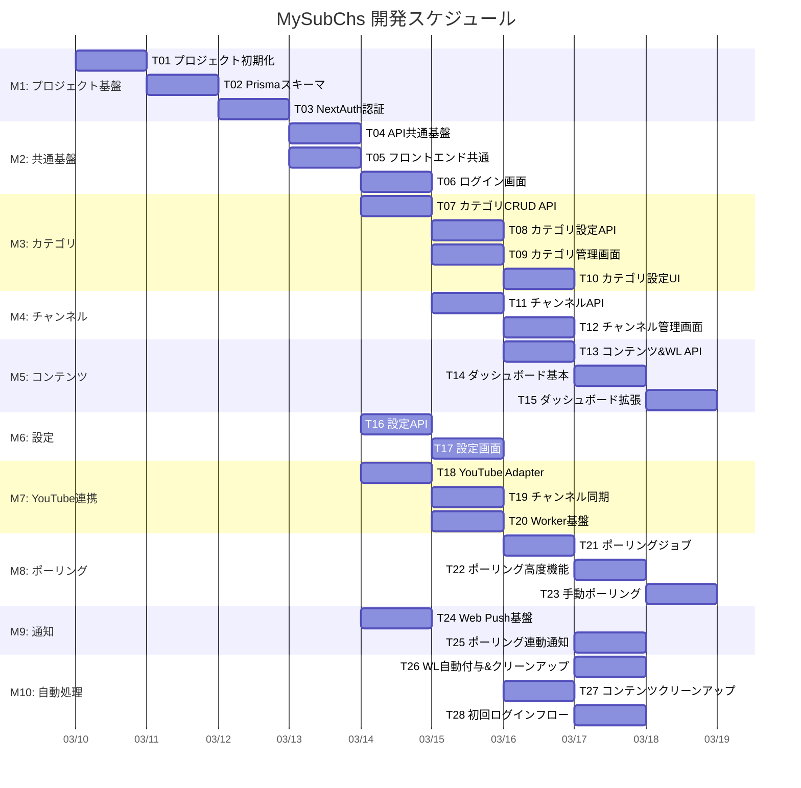

# MySubChs 開発計画

## 1. 概要

### 背景
MySubChsは、YouTubeのサブスクリプションをカスタムカテゴリに整理し、新着動画/ライブ配信を追跡してWeb Push通知を提供する個人向けWebアプリ。全仕様書（`docs/`）が完成済みで、AI仕様駆動開発により実装フェーズに移行する。

### 計画方針
- AIエージェント（Sonnet 4.5相当）が1セッションで完了できる粒度にタスク分解
- GitHub Issueで管理し、`dev-driver` Skillで実行
- 全28タスク、10マイルストーン、クリティカルパス9ステップ
- 承認後、`work/` フォルダにこの計画ファイルを配置する

---

## 2. Issue番号マッピング

| タスク | Issue | ブランチ名 | PR# |
|--------|-------|-----------|-----|
| T01 | #69 | feature/t01-project-init | #99 |
| T02 | #70 | feature/t02-prisma-schema | #100 |
| T03 | #71 | feature/t03-nextauth | #101 |
| T04 | #72 | feature/t04-api-common | #103 |
| T05 | #73 | feature/t05-frontend-common | #102 |
| T06 | #74 | feature/t06-login-page | #104 |
| T07 | #75 | feature/t07-category-crud-api | #106 |
| T08 | #76 | feature/t08-category-settings-api | #112 |
| T09 | #77 | feature/t09-category-management-ui | #113 |
| T10 | #78 | feature/t10-category-settings-ui | - |
| T11 | #79 | feature/t11-channel-api | - |
| T12 | #80 | feature/t12-channel-management-ui | - |
| T13 | #81 | feature/t13-content-watchlater-api | - |
| T14 | #82 | feature/t14-dashboard-basic | - |
| T15 | #83 | feature/t15-dashboard-extended | - |
| T16 | #84 | feature/t16-settings-api | #108 |
| T17 | #85 | feature/t17-settings-ui | - |
| T18 | #86 | feature/t18-platform-adapter | #109 |
| T19 | #87 | feature/t19-channel-sync | #116 |
| T20 | #88 | feature/t20-worker-foundation | - |
| T21 | #89 | feature/t21-polling-job | - |
| T22 | #90 | feature/t22-polling-advanced | - |
| T23 | #91 | feature/t23-manual-polling | - |
| T24 | #92 | feature/t24-web-push | #111 |
| T25 | #93 | feature/t25-polling-notifications | - |
| T26 | #94 | feature/t26-watchlater-auto-cleanup | - |
| T27 | #95 | feature/t27-content-cleanup | - |
| T28 | #96 | feature/t28-first-login-flow | - |

---

## 3. マイルストーン & ガントチャート



### クリティカルパス（9ステップ）

**パスA（バックエンドAPI → ダッシュボード）**:
T01 → T02 → T03 → T04 → T07 → T11 → T13 → T14 → T15

**パスB（Worker → ポーリング → 手動ポーリング）**:
T01 → T02 → T03 → T04 → T18 → T20 → T21 → T22 → T23

両パスとも9ステップ。最終タスク（T15, T23）が同じタイミングで完了する。

### 並行実行の機会

| タイミング | 並行可能タスク |
|-----------|--------------|
| Day 4 | T04 (API共通), T05 (Frontend共通) |
| Day 5 | T06, T07, T16, T18, T24 (最大5並行) |
| Day 6 | T08, T09, T11, T17, T19, T20 (最大6並行) |
| Day 7 | T10, T12, T13, T21, T27 (最大5並行) |
| Day 8 | T14, T22, T25, T26, T28 (最大5並行) |
| Day 9 | T15, T23 (最大2並行) |

---

## 4. タスク依存関係

| タスク | 依存タスク | 備考 |
|--------|-----------|------|
| T01 | - | 起点 |
| T02 | T01 | |
| T03 | T02 | middleware.ts含む。初回ログイン判定のスケルトンを用意 |
| T04 | T03 | |
| T05 | T03 | T04と並行可。エラー型はspec準拠で独立定義 |
| T06 | T05 | |
| T07 | T04 | BullMQジョブ操作はスタブ（T22の自己修復で整合性確保） |
| T08 | T07 | BullMQジョブ操作はスタブ |
| T09 | T05, T07 | |
| T10 | T09, T08, T16 | T16: クォータ表示に `GET /api/settings` が必要 |
| T11 | T07 | |
| T12 | T05, T11 | |
| T13 | T11 | |
| T14 | T05, T13 | ポーリングボタンはT23で追加 |
| T15 | T14 | |
| T16 | T04 | sync-channelsはスタブ（T19で完成） |
| T17 | T05, T16 | 通知セクションはUI先行実装（T24でバックエンド完成） |
| T18 | T04 | |
| T19 | T16, T18 | T16のsync-channelsスタブを実装に差し替え |
| T20 | T18 | worker.tsエントリーポイント作成 |
| T21 | T20 | Step 1-6のみ。Step 7(WL)/8(通知)はフックポイントのみ |
| T22 | T21 | 自己修復でT07/T08のBullMQスタブを解消 |
| T23 | T14, T22 | 手動ポーリングAPI + ダッシュボードのポーリングボタン |
| T24 | T04 | Service Worker + next-pwa + 購読API |
| T25 | T21, T24 | T21のStep 8フックを実装 |
| T26 | T21 | T21のStep 7フックを実装 + WatchLaterCleanupジョブ |
| T27 | T20 | |
| T28 | T19, T21 | T03の初回判定スケルトンを完成させる |

### スタブ戦略

本計画ではBullMQジョブ操作とYouTube API呼び出しにスタブを使用する。これはWorker（T20）がAPI基盤（T04）より後に実装されるため。

| スタブ箇所 | 導入タスク | 完成タスク | 安全策 |
|-----------|-----------|-----------|--------|
| カテゴリCRUD時のBullMQジョブ登録/削除 | T07 | T22 | Worker自己修復（T22 §4）が起動時に整合性を回復 |
| カテゴリ設定変更時のBullMQジョブ更新 | T08 | T22 | 同上 |
| グローバル設定変更時の一括ジョブ更新 | T16 | T22 | 同上 |
| チャンネル同期API (`POST /settings/sync-channels`) | T16 | T19 | モックレスポンス返却 |
| 設定画面の通知セクション（バックエンド） | T17 | T24 | ブラウザAPIのみ先行、サーバーAPIはT24で接続 |
| ポーリングのWatchLater自動付与（Step 7） | T21 | T26 | no-opフック |
| ポーリングの通知送信（Step 8） | T21 | T25 | no-opフック |

---

## 5. タスク詳細

### M1: プロジェクト基盤

#### T01: プロジェクト初期化 & Docker Compose環境構築
- **ゴール**: `docker compose up` で Next.js + PostgreSQL + Redis が起動する
- **スコープ**: Next.js 14作成、TypeScript/Tailwind CSS初期設定、Docker Compose（app/worker/db/redis）、`.env.example`（VAPID鍵プレースホルダー含む）、`.editorconfig`、`.gitattributes`、Vitestセットアップ（`vitest.config.ts`、`src/tests/setup.ts`、`src/tests/helpers/prisma-mock.ts`、`src/tests/helpers/request-helper.ts`、`package.json` テストスクリプト）
- **参照**: `docs/architecture.md` §1-3, `docs/infrastructure.md`
- **完了条件**:
  - `docker compose up` でブラウザに Next.js 初期ページが表示される
  - `npx vitest run` が正常に実行できる（テストファイルが0件でも終了コード0）

#### T02: Prismaスキーマ定義 & マイグレーション
- **ゴール**: 全テーブルがPostgreSQLに作成される
- **スコープ**: `prisma/schema.prisma`（User, Account, Category, Channel, Content, WatchLater, NotificationSetting, PushSubscription, UserSetting）、ENUM定義（Platform, ContentType, ContentStatus）、全インデックス、マイグレーション実行
- **参照**: `docs/database.md` 全体
- **完了条件**: `npx prisma migrate dev` が成功、`npx prisma studio` でテーブルが確認できる

#### T03: NextAuth.js認証基盤
- **ゴール**: Google OAuthでログイン/ログアウトが動作する
- **スコープ**: NextAuth設定（Google Provider, `youtube.readonly` scope）、JWT session strategy、Prisma Adapter、`middleware.ts`（未認証→`/login`リダイレクト、認証済み→`/login`から`/`へリダイレクト）、Account テーブルへのトークン保存、初回ログイン判定スケルトン（UserSetting存在チェックのみ、ジョブエンキューはT28）
- **参照**: `docs/integrations/youtube-auth.md` §1, `docs/ui/login.md` §6
- **完了条件**: ブラウザでGoogleログインが完了し、セッションが維持される

### M2: 共通基盤

#### T04: API共通基盤（設定定数・エラーハンドリング・認証ヘルパー）
- **ゴール**: APIルートで統一エラーレスポンスが返せる共通基盤が整う
- **スコープ**: `src/lib/config.ts`（YouTube quota定数等）、エラーレスポンスヘルパー（`docs/error-handling.md`準拠）、APIルート認証ヘルパー（セッション検証）、共通バリデーションユーティリティ、`src/lib/config.test.ts`（定数テスト）、`src/lib/errors.test.ts`（エラーヘルパーのユニットテスト）
- **参照**: `docs/error-handling.md`, `docs/architecture.md` §2, `ref/youtube-api.md`
- **完了条件**: テスト用APIルートで認証チェック・エラーレスポンスが正しく返る

#### T05: フロントエンド共通基盤（レイアウト・TanStack Query・shadcn/ui）
- **ゴール**: 共通レイアウトとTanStack Queryのグローバルエラーハンドリングが動作する
- **スコープ**: TanStack Query Provider（`retry: false`、グローバルエラーハンドラー）、shadcn/ui初期セットアップ（Button, Toast, Dialog等の基本コンポーネント）、共通レイアウト（ヘッダー: アプリ名、ナビ、ユーザーメニュー）、トースト通知基盤
- **参照**: `docs/ui/common.md` 全体
- **完了条件**: 共通レイアウトが表示され、401エラーでログインページにリダイレクトされる

#### T06: ログイン画面
- **ゴール**: `/login` からGoogleログインが完了し `/` にリダイレクトされる
- **スコープ**: `/login` ページ（Googleログインボタン、エラー表示、ローディング状態）、NextAuthエラーコードの日本語マッピング
- **参照**: `docs/ui/login.md`
- **完了条件**: ログイン画面表示→Googleログイン→ダッシュボードにリダイレクトが動作する

### M3: カテゴリ機能

#### T07: カテゴリCRUD API
- **ゴール**: カテゴリの作成・一覧・更新・削除・並べ替えがAPIで動作する
- **スコープ**: `GET /api/categories`、`POST /api/categories`（NotificationSetting自動生成）、`PATCH /api/categories/{id}`（名前更新）、`DELETE /api/categories/{id}`（チャンネルのcategoryId→NULL）、`PATCH /api/categories/reorder`。BullMQジョブ登録/削除は **no-opスタブ**（T22の自己修復で解消）。`src/app/api/categories/route.test.ts`（`GET/POST/PATCH/DELETE`の route.test.ts）
- **参照**: `docs/openapi.yaml` Categories、`docs/database.md` §2.3-2.6
- **完了条件**: 全5エンドポイントがopenapi.yaml通りのリクエスト/レスポンスで動作する

#### T08: カテゴリ設定API
- **ゴール**: カテゴリ別設定の取得・更新がAPIで動作する
- **スコープ**: `GET /api/categories/{id}/settings`、`PATCH /api/categories/{id}/settings`（通知・ポーリング・あとで見る設定の部分更新）。pollingIntervalMinutes変更時のBullMQジョブ更新は **no-opスタブ**。`src/app/api/categories/[id]/settings/route.test.ts`
- **参照**: `docs/openapi.yaml` CategorySettings、`docs/database.md` §2.6
- **完了条件**: 設定の取得・部分更新が正しく動作する

#### T09: カテゴリ管理画面（基本）
- **ゴール**: カテゴリの追加・編集・削除・並べ替えがUIで動作する
- **スコープ**: `/categories` ページ、カテゴリ一覧（sortOrder順）、インラインカテゴリ追加（Enter確定/Escape取消）、インライン名前編集、削除確認ダイアログ、D&D並べ替え（PC）、スケルトンローダー、空状態表示
- **参照**: `docs/ui/categories.md` §3-10
- **完了条件**: ブラウザでカテゴリCRUDとD&D並べ替えが正しく動作する

#### T10: カテゴリ設定UI
- **ゴール**: カテゴリ別設定の変更がUIで動作する
- **スコープ**: 各カテゴリの設定アコーディオン（ポーリング設定: ON/OFF + 間隔、通知設定: 3種トグル、あとで見る設定: ON/OFF + 自動期限）、変更即時反映（保存ボタンなし）、楽観的更新、クォータ表示（`GET /api/settings` 連携）
- **参照**: `docs/ui/categories.md` §7.3, `docs/ui/settings.md` §6（クォータ表示形式）
- **完了条件**: 設定変更が即時反映され、クォータ表示が更新される

### M4: チャンネル機能

#### T11: チャンネルAPI
- **ゴール**: チャンネル一覧取得とカテゴリ割当・解除がAPIで動作する
- **スコープ**: `GET /api/channels`（isActive/categoryIdフィルター、`uncategorized`キーワード対応）、`PATCH /api/channels/{id}`（categoryId変更、isActive=false による解除）。`src/app/api/channels/route.test.ts`
- **参照**: `docs/openapi.yaml` Channels
- **完了条件**: フィルター付き一覧取得、カテゴリ割当、チャンネル解除が動作する

#### T12: チャンネル管理画面
- **ゴール**: チャンネル一覧表示・カテゴリ割当・解除がUIで動作する
- **スコープ**: `/channels` ページ、情報バナー（設定画面へのリンク）、フィルター（アクティブ/解除済み）、カテゴリ別グループ表示（「未分類」固定末尾）、チャンネル行（アイコン、名前、カテゴリDropdown、解除ボタン）、楽観的更新、解除確認ダイアログ、レスポンシブ対応
- **参照**: `docs/ui/channels.md`
- **完了条件**: ブラウザでチャンネルのカテゴリ割当・解除が正しく動作する

### M5: コンテンツ & ダッシュボード

#### T13: コンテンツAPI & あとで見るAPI
- **ゴール**: カーソルページネーションによるコンテンツ一覧とあとで見る操作がAPIで動作する
- **スコープ**: `GET /api/contents`（categoryId必須、cursor/limit/order/watchLaterOnly/includeCancelledフィルター、Base64カーソル、keyset pagination `(contentAt, id)`)、`PUT /api/watch-later/{contentId}`（MANUAL追加、UPSERT）、`DELETE /api/watch-later/{contentId}`（removedVia='MANUAL' ソフト削除）。`src/app/api/contents/route.test.ts`・`src/app/api/watch-later/route.test.ts`（カーソルページネーション含む）
- **参照**: `docs/openapi.yaml` Contents/WatchLater、`docs/architecture.md` §6、`docs/database.md` §2.5
- **完了条件**: ページネーション・ソート切替・フィルター・あとで見るON/OFFが正しく動作する

#### T14: ダッシュボード画面（基本）
- **ゴール**: カテゴリ選択→コンテンツ一覧の無限スクロール表示が動作する
- **スコープ**: `/` ページ（2カラム: サイドバー + メイン）、サイドバー（カテゴリ一覧、選択状態、「未分類」固定末尾、モバイルはハンバーガー/ドロワー）、メインエリアヘッダー（カテゴリ名表示）、コンテンツリスト（`useInfiniteQuery`、20件/fetch、下端到達で自動読込）、コンテンツアイテム（ステータスバッジ5種、タイトル→YouTube外部リンク、チャンネル名、日時表示）、スケルトンローダー
- **参照**: `docs/ui/dashboard.md` §2-6
- **完了条件**: ブラウザでカテゴリ選択→コンテンツ一覧の無限スクロールが動作する

#### T15: ダッシュボード拡張（フィルター・あとで見る・各種状態）
- **ゴール**: ソート・フィルター・あとで見るトグル・各種状態表示が動作する
- **スコープ**: ソートトグル（新しい順↔古い順、切替時カーソルリセット）、フィルター（あとで見るのみ、キャンセル済み含む）、あとで見るトグル（楽観的更新、PUT/DELETE）、空状態パターン（コンテンツなし、チャンネルなし等）、クォータ枯渇バナー、初回ログインローディング表示
- **参照**: `docs/ui/dashboard.md` §5.1, §6, §7
- **完了条件**: 全フィルター・ソート・あとで見るトグルが仕様通り動作し、空状態が適切に表示される

### M6: 設定機能

#### T16: 設定API
- **ゴール**: ユーザー設定の取得・更新とクォータ情報の提供がAPIで動作する
- **スコープ**: `GET /api/settings`（UserSetting + estimatedDailyQuota/quotaWarningThreshold/quotaDailyLimit/tokenStatus/quotaExhaustedUntil）、`PATCH /api/settings`（pollingIntervalMinutes/contentRetentionDays更新）、`POST /api/settings/sync-channels` **スタブ**（T19で完成）。グローバルpollingIntervalMinutes変更時の一括ジョブ更新は **no-opスタブ**。estimatedDailyQuota計算ロジック実装。UserSetting自動生成（初回アクセス時）
- **参照**: `docs/openapi.yaml` Settings、`docs/integrations/youtube-polling.md` §11
- **完了条件**: 設定取得（クォータ情報含む）・更新が動作する

#### T17: 設定画面
- **ゴール**: 設定画面の全セクションがUIで動作する（通知バックエンド・チャンネル同期はスタブ）
- **スコープ**: `/settings` ページ、アカウントセクション（tokenStatus表示、再認証ボタン）、ポーリング設定（間隔Dropdown + クォータ表示 + 警告）、コンテンツ保持期間（Dropdown + 説明文）、チャンネル同期ボタン（スタブ）、通知セクション（ブラウザPermission判定、有効化/テストボタンのUI、バックエンドAPI接続はT24完成後に動作）
- **参照**: `docs/ui/settings.md`
- **完了条件**: ブラウザで設定画面の全セクションが表示・操作できる（スタブ部分はUIのみ）

### M7: YouTube連携

#### T18: Platform Adapter & YouTube実装
- **ゴール**: YouTube Data API v3の各エンドポイントを呼び出せるアダプターが実装される
- **スコープ**: `src/lib/platforms/base.ts`（PlatformAdapter interface）、`src/lib/platforms/youtube.ts`（subscriptions.list、channels.list、playlistItems.list、videos.list のラッパー）、ページネーション対応、バッチリクエスト（videos.list 50件/call）、quotaExceeded検出
- **参照**: `docs/architecture.md` §5、`ref/youtube-api.md`
- **完了条件**: 各YouTube APIエンドポイントのラッパーが実装され、型定義が正しい

#### T19: チャンネル同期実装
- **ゴール**: 設定画面からYouTubeチャンネル同期が動作する
- **スコープ**: T16の `POST /api/settings/sync-channels` スタブを実装に差し替え。subscriptions.list全ページ取得→channels.listバッチ取得→DB UPSERT（新規INSERT/復元/無効化/メタデータ更新）→結果カウント返却
- **参照**: `docs/integrations/youtube-auth.md` §2
- **完了条件**: 設定画面からチャンネル同期を実行し、追加/復元/無効化/更新の件数が表示される

#### T20: BullMQ Worker基盤 & トークンリフレッシュ
- **ゴール**: BullMQ Workerが起動しOAuthトークンリフレッシュが動作する
- **スコープ**: `src/jobs/worker.ts`（Workerエントリーポイント）、BullMQ Queue/Worker設定、OAuthトークンリフレッシュ（`Account.expires_at` < now → Google Token Endpoint呼び出し → DB更新）、`token_error` ハンドリング（エラー時はジョブ即FAILED、リトライなし）
- **参照**: `docs/integrations/youtube-auth.md` §3-4、`docs/infrastructure.md`（Docker Compose worker設定）
- **完了条件**: `docker compose up` でWorkerコンテナが起動し、トークンリフレッシュが動作する

### M8: ポーリングシステム

#### T21: ポーリングジョブ実装
- **ゴール**: カテゴリのポーリングジョブが定期実行されコンテンツがDBに保存される
- **スコープ**: BullMQ Repeatable Job（`auto-poll:{categoryId}`）登録、ポーリングフロー Step 1-6（チャンネル取得→uploadsPlaylistIdキャッシュ→playlistItems.list→新着判定→videos.listバッチ→Content UPSERT + contentAt計算 + status遷移ロジック）。Step 7（WatchLater自動付与）とStep 8（通知送信）は **no-opフックポイント** のみ用意。Channel.lastPolledAt更新
- **参照**: `docs/integrations/youtube-polling.md` §1-3, §5-6, §8
- **完了条件**: ポーリングジョブ実行後、YouTubeの最新コンテンツがContentテーブルに保存される

#### T22: ポーリング高度機能（自己修復・重複排除・クォータ管理）
- **ゴール**: Worker自己修復・ジョブ重複排除・クォータ枯渇時の自動停止が動作する
- **スコープ**: Worker起動時の自己修復（DB⇔Redis Repeatable Job整合性チェック）、ジョブ重複排除（固定jobId + Redis SET NX PXロック）、クォータ枯渇検出（YouTube 403 → Redis `quota:exhausted` フラグ設定、TTL=翌日UTC 00:00まで）、枯渇時のポーリングスキップ、`GET /api/settings` の `quotaExhaustedUntil` 連携。**T07/T08/T16のBullMQスタブを自己修復で解消**
- **参照**: `docs/integrations/youtube-polling.md` §4, §11, §13, §14
- **完了条件**: Worker再起動時に整合性が回復し、クォータ枯渇時にポーリングが停止→翌日自動再開する

#### T23: 手動ポーリングAPI & UI統合
- **ゴール**: ダッシュボードから手動ポーリングが実行・状態表示される
- **スコープ**: `POST /api/categories/{id}/poll`（one-offジョブエンキュー、Redis cooldown TTL=300秒）、`GET /api/categories/{id}/poll/status`（ジョブステータス + cooldownRemaining返却）、ダッシュボードのポーリングボタン（通常/実行中/クールダウン/クォータ枯渇の4状態、3秒間隔のステータスポーリング、最大100回/5分タイムアウト）、クールダウン中のカウントダウン表示
- **参照**: `docs/integrations/youtube-polling.md` §12、`docs/ui/dashboard.md` §5.2
- **完了条件**: ダッシュボードからポーリング実行→完了→コンテンツ更新→クールダウン表示が動作する

### M9: 通知 & PWA

#### T24: Web Push基盤 & PWA設定
- **ゴール**: Web Push通知の購読・テスト送信が動作する
- **スコープ**: `worker/index.js`（push/notificationclick/pushsubscriptionchangeイベント）、next-pwa設定（`runtimeCaching: []`、`skipWaiting: true`）、`POST /api/notifications/subscriptions`（Base64url鍵デコード + DB保存）、`DELETE /api/notifications/subscriptions/{id}`、`POST /api/notifications/test`（web-push送信）、T17の通知セクションとのバックエンド接続確認
- **参照**: `docs/ui/pwa.md`、`docs/openapi.yaml` Notifications
- **完了条件**: 設定画面から通知有効化→テスト通知受信が動作する

#### T25: ポーリング連動通知配信
- **ゴール**: ポーリング時に設定に基づいたWeb Push通知が配信される
- **スコープ**: T21のStep 8フックを実装。通知トリガー判定（notifyOnNewVideo/notifyOnLiveStart/notifyOnUpcoming）、通知ペイロード構築（タイトル、本文、アイコン、URL）、同チャンネル複数通知の集約、最大5件 + サマリー通知のバッチ処理、優先順位（ライブ開始 > 予定 > 新着動画）、PushSubscription 410エラー時の購読削除
- **参照**: `docs/integrations/youtube-polling.md` §7
- **完了条件**: ポーリング実行時にカテゴリ設定に基づいた通知が配信される

### M10: 自動処理 & 初回ログイン

#### T26: あとで見る自動付与 & クリーンアップジョブ
- **ゴール**: ポーリング時のあとで見る自動付与と期限切れクリーンアップが動作する
- **スコープ**: T21のStep 7フックを実装。カテゴリの`watchLaterDefault=true` 時に新着コンテンツへWatchLater自動生成（`removedVia IS NOT NULL` チェック、`addedVia=AUTO`、`expiresAt`計算）。WatchLaterCleanupジョブ（BullMQ cron `0 19 * * *` = JST 04:00、`expiresAt < NOW()` の物理削除、`removedVia IS NOT NULL` は対象外）
- **参照**: `docs/integrations/youtube-polling.md` §6 Step 7, §9
- **完了条件**: ポーリング後に自動フラグが付与され、クリーンアップジョブで期限切れが削除される

#### T27: コンテンツクリーンアップジョブ
- **ゴール**: 保持期間を超えたコンテンツが自動削除される
- **スコープ**: ContentCleanupジョブ（BullMQ cron `0 18 * * *` = JST 03:00）、保持期間判定（VIDEO: `publishedAt`、LIVE: `actualStartAt` → `scheduledStartAt` → `createdAt` フォールバック）、status=LIVEのコンテンツは削除対象外、WatchLaterカスケード削除。`src/jobs/contentCleanup.test.ts`（削除判定ロジック・日付計算のユニットテスト）
- **参照**: `docs/integrations/youtube-polling.md` §10
- **完了条件**: クリーンアップジョブ実行後、期間超過コンテンツが削除される（LIVE中は除外）

#### T28: 初回ログインフロー
- **ゴール**: 初回ログイン時にチャンネル同期→ポーリングが自動実行される
- **スコープ**: T03の初回ログイン判定スケルトンを完成。NextAuth signInコールバックでUserSetting不在を検出→BullMQ `setupJob`（delay: 0、attempts: 3）をエンキュー。setupJobの処理: チャンネル同期（T19ロジック呼び出し）→全カテゴリポーリング（T21ロジック呼び出し）。ダッシュボードの初回ローディングUI連携確認
- **参照**: `docs/integrations/youtube-auth.md` §1
- **完了条件**: 新規ユーザーで初回ログイン→チャンネル取得→コンテンツ表示までが自動で完了する

---

## 6. Issue構成テンプレート

```markdown
## タスク概要
{タスク名とゴールの1行説明}

## 参照仕様
- {関連する仕様書ファイルパスとセクション番号のリスト}

## 実装スコープ
{作成・変更するファイル/コンポーネントの具体的なリスト}

## スタブ・制約事項
{BullMQスタブ等の注意事項。該当しない場合は省略}

## 完了条件
{検証可能な完了基準のリスト}

## ブランチ名
feature/{task-id}-{short-name}
```


## 7. 決定事項 & 仕様確認事項

### 決定済み
- **テストフレームワーク**: Vitest を採用する。ユニットテスト（`src/lib/`・`src/jobs/` の純粋関数）とAPIルートテスト（integration、Prismaモック使用）を対象とする。UIコンポーネントテストは現フェーズでは対象外。

### 実装時に確認が必要な事項
1. **クォータリセット時刻**: `ref/youtube-api.md` では「太平洋時間 深夜0時（JST 16:00-17:00）」、`youtube-polling.md` §13では「翌日 UTC 00:00」としてTTLを計算している。UTC 00:00 と太平洋時間 00:00 は異なる（約7-8時間差）。T22実装時に方針確認が必要。
2. **NotificationSettingの命名**: テーブル名は `NotificationSetting` だが、実際にはポーリング設定・あとで見る設定も含む「カテゴリ別設定」テーブル。コード上の命名方針を確認（テーブル名はDB仕様通り維持しつつ、コメントで補足する方針を推奨）。
